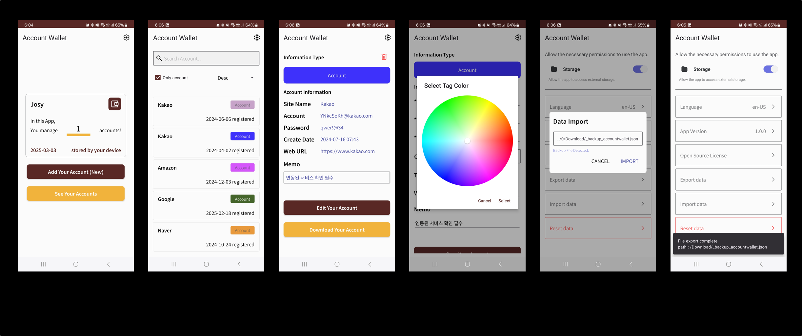
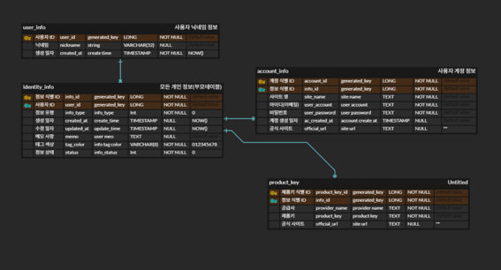

# 📌 프로젝트명 : Account Wallet

> 사용자 계정 관리 앱

## 📂 프로젝트 개요

- **개발 기간**: 2025. 01. 19. ~ 2025. 03. 02. (42 일)
- **개발 인원**: 개인 프로젝트 (1인)

## 🛠️ 기술 스택

<ul>
 <li>Kotlin</li>
 <li>DataBinding</li>
 <li>Androidx Navgation</li>
 <li>Flexbox</li>
 <li>Room</li>
 <li>Kotlinx Coroutine</li>
 <li>Livedata</li>
 <li>ViewModel</li>
 <li>Gson</li>
 <li>OSS Licenses Plugin</li>
 <li>Google AD mob</li>
 <li>Multidex</li>
 <li>Hlit</li>
 <li>Paging</li>
</ul>

## ✨ 주요 기능

| 기능 구분             | 설명 |
|------|------|
| 계정 정보 집계 기능         | 앱에 저장된 계정·개인정보의 통계를 시각적으로 제공 |
| 계정 정보 관리 기능         | 사용자 계정 정보를 내부 DB 기반으로 CRUD 방식으로 관리 |
| 계정 정보 백업/복원 기능    | 저장된 데이터를 JSON 형식으로 내보내거나 불러오는 기능 제공 |
| 계정 정보 문서화 기능       | 선택한 계정 정보를 개별 문서 형태로 저장 및 출력 |
| 계정 정보 맞춤형 라벨링 기능 | 제품 키, 개인 계정 등 정보 유형별로 구분하고 색상 태그를 통해 직관적인 분류 및 관리 지원 |

## 🖼️ 앱 구현 화면

## 🧩 데이터베이스 설계도 (ERD)

## ⚙️ 기술적 배경 및 개선 방향 (AS-IS / TO-BE)

`AS-IS`
- 엑셀을 사용해 계정 정보를 관리했던 불편 해소
- 계정을 관리할 때, 명함 지갑처럼 실용적이면서도 보기 좋은 유틸리티 개발 도전
- 데이터 백업이나 복원을 자동화하여 간단한 조작을 통한 동기화 기능 지원

`TO-BE`
- Android APP 개발로 스마트폰에서 사용할 수 있는 계정 관리 앱 개발.
- 사용자 친화적인 UI 제공 및 색상 Hex 값을 활용한 꾸미기 기능으로 사용성 향상.
- 요구사항 정의 및 ERD 기반 설계를 통해 구조적인 데이터베이스 설계 진행.
- JSON 및 GSON을 활용하여 데이터 내보내기/가져오기 기능 구현 → 데이터 호환성과 백업 편의성 확보.
